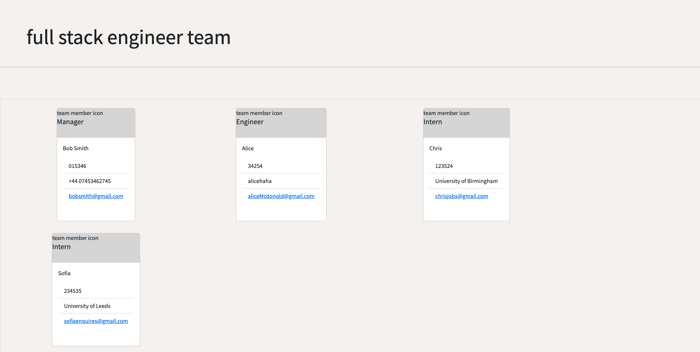

# employee-profile-generator

## Table of Contents

- [About this Project](#about-this-project)
- [Links to the Project](#Links-to-the-Project)
- [User Story](#User-Story)
- [Criteria](#Criteria)
- [Mock-Up](#Mock-Up)
- [Run the project](#Run-the-project)
- [File Structure](#File-Structure)
- [Employee Classes Structure](#Employee-Classes-Structure)
- [Technologies](#Technologies)
- [How To Contact Me](#How-To-Contact-Me)
- [Authored by](#Authored-by)

<br>

## About this Project

```
The project is to build a Node.js command-line application that takes in information about employees on a software engineering team, then generates an HTML webpage that displays summaries for each person. Testing is key to making code maintainable, so I also write a unit test for every part of the code and ensure that it passes each test.

Because this application won’t be deployed, I provide a link to a walkthrough video that demonstrates its functionality and all of the tests passing.
```

<br>

## Links to the Project

Check out the Github Repository [Here](https://github.com/jinyiyu/employee-profile-generator/tree/main)

Check out the deployed URL [Here](https://jinyiyu.github.io/my-personal-protfolio/)

<br>

## User Story

```md
AS A manager
I WANT to generate a webpage that displays my team's basic info
SO THAT I have quick access to their emails and GitHub profiles
```

## Criteria

```md
GIVEN a command-line application that accepts user input
WHEN I am prompted for my team members and their information
THEN an HTML file is generated that displays a nicely formatted team roster based on user input
WHEN I click on an email address in the HTML
THEN my default email program opens and populates the TO field of the email with the address
WHEN I click on the GitHub username
THEN that GitHub profile opens in a new tab
WHEN I start the application
THEN I am prompted to enter the team manager’s name, employee ID, email address, and office number
WHEN I enter the team manager’s name, employee ID, email address, and office number
THEN I am presented with a menu with the option to add an engineer or an intern or to finish building my team
WHEN I select the engineer option
THEN I am prompted to enter the engineer’s name, ID, email, and GitHub username, and I am taken back to the menu
WHEN I select the intern option
THEN I am prompted to enter the intern’s name, ID, email, and school, and I am taken back to the menu
WHEN I decide to finish building my team
THEN I exit the application, and the HTML is generated
```

<br />

## Mock-Up

The following image shows a mock-up of the generated HTML’s appearance and functionality:



<br />

## Run the project

This application is used [Jest](https://www.npmjs.com/package/jest) for running the unit tests and [Inquirer](https://www.npmjs.com/package/inquirer) for collecting input from the user. The application will be invoked by using the following command:

```bash
git clone git@github.com:jinyiyu/employee-profile-generator.git
cd readme-generator
npm init -y
```

Then a package.json file would pop up in your folder, click to enter the file, and change the script to :

```
"start":"node index.js"
```

Then go to your terminal, install relevant dependency packages:

```
npm install Jest Inquirer
```

And run the project by following the instructions below:

```
npm run start
```

## File Structure

please look at following chart for the directory structure:

```md
.
├── **tests**/ //jest tests
│ ├── Employee.test.js
│ ├── Engineer.test.js
│ ├── Intern.test.js
│ └── Manager.test.js
├── dist/ // rendered output (HTML) and CSS style sheet  
├── lib/ // classes
├── src/ // template helper code
├── .gitignore // indicates which folders and files Git should ignore
├── index.js // runs the application
└── package.json
```

## Employee Classes Structure

The application include `Employee`, `Manager`, `Engineer`, and `Intern` classes. These classes is ALL passed the Jest Test.

The first class is an `Employee` parent class with the following properties and methods:

- `name`

- `id`

- `email`

- `getName()`

- `getId()`

- `getEmail()`

- `getRole()`&mdash;returns `'Employee'`

The other three classes will extend `Employee`.

In addition to `Employee`'s properties and methods, `Manager` will also have the following:

- `officeNumber`

- `getRole()`&mdash;overridden to return `'Manager'`

In addition to `Employee`'s properties and methods, `Engineer` will also have the following:

- `github`&mdash;GitHub username

- `getGithub()`

- `getRole()`&mdash;overridden to return `'Engineer'`

In addition to `Employee`'s properties and methods, `Intern` will also have the following:

- `school`

- `getSchool()`

- `getRole()`&mdash;overridden to return `'Intern'`

## Technologies

- Node.js
- Inquirer
- Unit Test - Inquirer
- HTML
- CSS
- Javascript
- Bootstrap

<br>

## How To Contact Me

Please contact me if you have any inquiries

[](https://github.com/jinyiyu)
[](https://www.linkedin.com/in/jinyiyu/)
[](https://www.instagram.com/jinyiyu517/)
[](mailto:yujinyiicxk@gmail.com)

## Authored by

### **Jinyi Yu**
